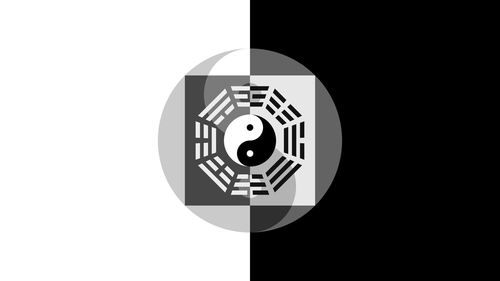

#### 基于后天八卦的图片绘制python脚本

这是一个基于后天八卦的python脚本，该图曾经使用网上的图片+photoshop后改为微信朋友圈背景，但有瑕疵。瑕疵部分感谢lyy同学曾经帮我改过反色，但始终不太满意。

这次使用python使用Pillow纯代码绘制，并增加了一些新的内容，目前来看比较完美。其中抗锯齿是采用扩大后，再使用Pillow内置的API缩小实现的。其他一些代码中玄妙的设计，请有心者结合代码和注释自行感悟，实在懒得写文档了:-(

这是生成的1920x1080的图片，当然也可以改成其他尺寸而不会损失画质:-)

